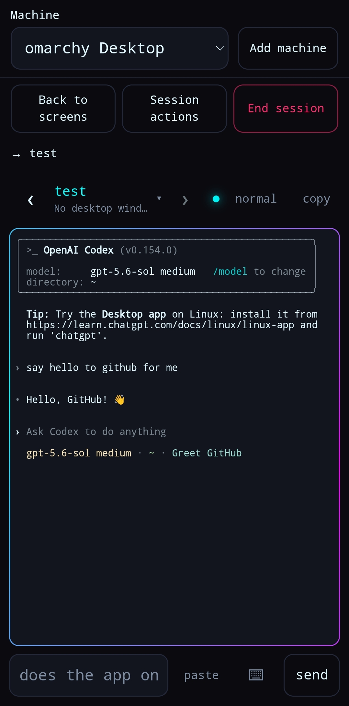

# deskpilot

A phone-facing remote for the machine you left running.

Coding agents work for minutes at a time and then stop to ask a question. If you are not
at the desk when that happens, the work is not slow — it is stopped. deskpilot puts those
sessions on your phone: see which one is blocked and on what, answer it, start new work,
copy a command or a path out of a session into the phone's clipboard, paste one back in,
and — on Hyprland — look at the screen and move windows.

It runs entirely on your own hardware. There is no service in the middle, no account, and
nothing leaves your machine except the notifications you asked for.

<p align="center">
  
</p>

From the phone you can:

- read and control live tmux terminals;
- see which agents are working, blocked, or done;
- move between several machines and sessions;
- start work, paste text, copy output, and answer safe permission prompts; and
- inspect screens and move windows when the desktop supports it.

## Contents

- [Quick start](#quick-start)
- [How it works](#how-it-works)
- [Requirements](#requirements)
- [Installation options](#installation-options)
- [Starting desktop sessions](#starting-desktop-sessions)
- [Connecting a phone](#connecting-a-phone)
- [Updating](#updating)
- [Uninstalling](#uninstalling)
- [Security](#security)
- [Development and releases](#development-and-releases)

## Quick start

Four steps on the desktop, then scan a QR with your phone. Each is expanded below.

`deskpilot` is a command, and step 1 is what puts it on your PATH. **Running from a
source checkout instead?** Skip to [building from source](#building-from-source) —
`shell/setup.sh` replaces steps 1–2 and installs a `deskpilot` shim, after which steps
3–4 are word for word the same.

```bash
# 1 — install (verifies the published checksum first; read it, it installs as root)
curl -fsSL https://github.com/Kleebz/deskpilot/releases/latest/download/install.sh -o install.sh
less install.sh && sh install.sh

# 2 — start
deskpilot setup
systemctl --user daemon-reload && systemctl --user enable --now deskpilot

# 3 — give it an address your phone can reach. NOT optional.
tailscale up                       # opens a browser to sign in
tailscale serve --bg --yes 8790

# 4 — pair
deskpilot pair
```

Step 4 prints a QR and the complete pairing link. The link already contains the one-time
code; scan the QR or open the link, add the page to your home screen, and you are done —
it is a web app, so there is nothing to download.

**Step 3 is where installs go wrong.** deskpilot listens on loopback on purpose, so until
something fronts it there is no address for a phone to open at all. Two things people
miss: HTTPS certificates have to be switched on once for your tailnet at
[login.tailscale.com/admin/dns](https://login.tailscale.com/admin/dns), and **the phone
needs Tailscale too, signed in** — the address is a tailnet name, so a phone that is not
on the tailnet cannot resolve it and the scan lands on "can't be reached". If anything is
missing, `deskpilot pair` says so instead of printing a QR that leads nowhere.

Want an agent to do it? See [installing with an agent](#installing-with-an-agent).

## How it works

Deskpilot sends terminal text rather than streaming a remote desktop. A screen of terminal
output is roughly 2 KB of text where a screenshot of the same thing is often 130–210 KB.
It uses a cropped still only when the pixels themselves matter, and it sends no video.

A session is a tmux session, so Claude Code, Codex, Aider, and ordinary shells all work
through the same interface. tmux also keeps them alive when the browser disconnects or the
Deskpilot service restarts.

## Requirements

**tmux.** That is the whole hard requirement.

Everything desktop-shaped is optional and negotiated: the server reports what it can do
and the app hides the rest. A headless box serves sessions and terminals and honestly says
it has no windows — that path is tested on every commit, not assumed.

Read the table as "what each feature costs", not as a list of things to install. Only the
first row is required; a machine with none of the rest is a supported configuration that
`shell/check.sh` passes and `tests/headless.sh` exercises on every commit.

| For | You need | Required? |
|---|---|---|
| sessions, terminals, pairing, notifications | `tmux` | **yes — the only one** |
| window listing, moving, tiling | Hyprland **0.56.2+** | no |
| screenshots | `grim`, and a readable lock state | no |
| remote unlock and input | `ydotool` — **any Linux**, no compositor needed | no |

Note which row needs no compositor at all: unlock and input injection. `ydotool` writes to
`/dev/uinput`, which is the kernel — it is why this reaches a lock screen at all, since it
sits below the Wayland layer that refuses virtual keyboards. It works on GNOME, KDE, Sway
or a bare TTY, and needs no compositor support. Only windows and screenshots are
Hyprland's.

0.56.2 is a real floor, not a preference: every dispatcher moved to a Lua API in that
release, and on an older Hyprland the window commands fail without saying so. The server
detects it and reports the desk tier as unavailable rather than appearing to work.

The desk half is Hyprland-only today. It is one shell script, `scripts/desk.sh`, kept
readable and shipped beside the binary rather than compiled into it, precisely so that a
second compositor is somebody's afternoon rather than a rewrite.

**Running headless is a first-class case, not a degraded one.** `tests/headless.sh`
sandboxes a host with no compositor, no `hyprctl`, no `grim` and no Wayland socket, and
asserts that the server starts, lists tmux sessions with `workspace: null`, upgrades the
terminal WebSocket, pairs a device and reports `compositor: none` instead of erroring. CI
runs it on every commit and the release workflow refuses to ship a binary that fails it.

## Installation options

Every release ships a single binary — the server and the web UI in one file, so the
target needs neither Deno nor npm. Released builds are **x86_64 only**; on anything else
the installer stops and tells you to build from source, which works fine. There is also a
[source build](#building-from-source) if you would rather compile it yourself.

The quick way, which verifies the published checksum before installing anything:

```
curl -fsSL https://github.com/Kleebz/deskpilot/releases/latest/download/install.sh -o install.sh
less install.sh          # it installs as root; read it first
sh install.sh
```

Piping straight into `sh` works too. It is not suggested first on purpose: this is a tool
that runs commands on your machine, which makes it a poor candidate for executing code you
have not read.

By hand, if you prefer — download the tarball from
[releases](https://github.com/Kleebz/deskpilot/releases), check it against the published
`.sha256`, then:

```
tar xzf deskpilot-*-x86_64.tar.gz
sudo install -Dm755 deskpilot /usr/bin/deskpilot
sudo install -Dm755 scripts/*.sh -t /usr/share/deskpilot/scripts/
```

That path is part of the binary's subprocess allowlist, which is fixed at build time.
Runtime helpers installed elsewhere will be refused.

Then set it up and start it:

```
deskpilot setup
systemctl --user daemon-reload
systemctl --user enable --now deskpilot
```

`setup` makes a token, writes the user service, and prints those two commands. It runs
`systemctl` for you nowhere — that would mean adding it to the server's subprocess
allowlist, which is not a trade worth making to save you a paste.

Every release includes a generated `PKGBUILD` for Arch:

```
gh release download vX.Y.Z -p PKGBUILD
makepkg -si
```

### Installing with an agent

If you are already driving this machine through Claude Code or a similar agent, hand it
this and let it work:

> Install deskpilot on this machine by following
> `https://raw.githubusercontent.com/Kleebz/deskpilot/main/docs/agent-install.md`
> exactly. Stop and ask me at each step it marks HUMAN.

[`docs/agent-install.md`](docs/agent-install.md) is written for an agent rather than a
person: ordered steps, a verification command after each one, and what the specific
failure looks like when that check is the thing that catches it. Most of those checks
exist because the failure is otherwise silent — the install looks finished and the phone
cannot connect, with nothing anywhere saying why.

It also marks the three things an agent cannot do for you — `sudo`, the Tailscale browser
login and the admin-console setting it needs, and scanning the QR — so it stops and asks
rather than guessing or quietly skipping them.

## Building from source

You need `deno`, `node` and `npm` — none of which the released binary requires, which is
the point of shipping one.

```
git clone https://github.com/Kleebz/deskpilot
cd deskpilot
npm --prefix web install
```

From there, two paths.

**Run it from the checkout.** No binary; the service runs `deno` against the repo, so
edits take effect on a restart. This is the development setup and the one to use if you
intend to change anything:

```
shell/setup.sh
```

It builds the UI, installs a `deskpilot` shim at `~/.local/bin/deskpilot`, installs a user
service pointing at this directory, and runs the checks. The shim is why every command in
this README reads the same on a checkout as on a release install.
It asks before touching your shell profile or `~/.claude/settings.json`, and `--yes`,
`--no-shell` and `--no-claude` answer for it. Because the service points at the checkout,
**moving or deleting the directory breaks it** — re-run `shell/setup.sh` after a move.
If an older release command earlier in `PATH` shadows the source shim, setup reports the
exact two paths rather than claiming the source command is ready.

**Or build the binary yourself**, which is what the release does:

```
shell/build.sh
sudo install -Dm755 dist/deskpilot /usr/bin/deskpilot
sudo install -Dm755 dist/scripts/*.sh -t /usr/share/deskpilot/scripts/
deskpilot setup
```

`build.sh` takes the scripts path as its second argument and defaults to
`/usr/share/deskpilot/scripts`. That value is compiled into the binary's allowlist, so if
you install `desk.sh` somewhere else you have to build with that path — the two are not
independent.

Verified from a clean clone: `npm install`, build, typecheck, tests and the binary all
work with no prior state.

## Starting desktop sessions

To open a normal login shell in a new desktop window and make that shell
available on mobile:

```bash
deskpilot session
deskpilot session writing
```

This explicit launcher does not edit shell profiles, intercept the ordinary terminal
command, or replace the login shell. The new window runs the same login shell inside a
tmux session named `desk` (or the supplied name); collisions receive `-2`, `-3`, and so
on. Closing the window detaches it, while exiting the shell ends it. Installed desktops
also expose **Deskpilot Terminal** in the application launcher.

To start an agent on the desktop and control that same process from the phone later:

```bash
deskpilot run codex
deskpilot run claude
deskpilot run aider --model sonnet
```

`deskpilot run` creates a named tmux session from the current directory and attaches the
terminal you are already using. Leaving the desk, closing the terminal, or losing the
phone connection does not stop the command; it remains available in Deskpilot's Sessions
view. Name collisions receive `-2`, `-3`, and so on automatically.

This is the explicit alternative to shell integration. It does not edit a shell profile
or shadow the underlying command. Running `tmux new-session -s NAME COMMAND` directly
also works, because Deskpilot discovers every tmux session rather than only ones it made.

An arbitrary process started outside tmux cannot be moved into it later. Deskpilot can
track supported agents in that state and show their desktop windows, but terminal capture
and input require starting them with `deskpilot run` (or tmux itself).

## Connecting a phone

Deskpilot listens on loopback, so [Tailscale](https://tailscale.com) must provide the
phone-facing HTTPS address:

```
shell/use-https.sh          # from a checkout
tailscale serve --bg --yes 8790   # or by hand, on a release install
```

Enable HTTPS certificates once in the
[Tailscale DNS settings](https://login.tailscale.com/admin/dns). Install Tailscale on the
phone and sign into the same tailnet before scanning anything; otherwise its private host
name will not resolve.

Then, on the machine:

```
deskpilot pair
```

The QR and link contain an eight-character, single-use code valid for ten minutes. Scan or
open either one; there is no second code to enter. `deskpilot pair --link` prints only the
link for scripts or agents to relay.

For the first machine, open the link directly and install the app. To add another machine,
open the installed app, choose **Add machine**, and paste the new machine's pairing link.
Each phone or browser receives its own revocable credential.

Two things it can say instead of printing a QR, and they are not the same problem:

- **nothing answered on an address a phone could reach** — start Tailscale Serve and try
  again;
- **I could not run desk.sh** — install the runtime helpers at the path printed by the
  command.

### Installing it on the phone

Deskpilot is a progressive web app:

- **Android / Chrome:** use **Install** or **Add to Home screen** from the browser menu.
- **iOS / Safari:** tap **Share**, then **Add to Home Screen**.

Installation provides full-screen use, durable local settings, offline access to the
machine picker, and iOS push notifications. It requires HTTPS.

The machine picker switches between paired hosts. Swipe horizontally between terminals,
or tap the session name to jump directly. **Screens** provides workspace and window
controls where supported. **Manage** contains devices, credentials, notifications, and
machine labels. Drafts and the current view are restored after backgrounding without
submitting or repeating an action.

More operational detail and troubleshooting live in [docs/setup.md](docs/setup.md). The
transport and trust decisions are recorded in [docs/decisions.md](docs/decisions.md).

## Updating

**Sessions survive it.** tmux runs as a child of the service unit with `KillMode=process`,
so a restart leaves every session attached and running — verified when the service
crash-looped for thirty seconds and everything was still there afterwards.

`deskpilot version` says what the command will run, and `shell/check.sh` verifies the live
service. The app also shows the version of each selected machine under **Manage**.

**From a release** — the `install.sh` path:

```
sudo deskpilot update
systemctl --user restart deskpilot
```

`update` fetches the release index, verifies the published SHA-256 **before touching
anything on disk**, and stages the binary, runtime helpers, and application launcher
together. `deskpilot update --check` looks without installing, and a version argument
pins it (`sudo deskpilot update 0.1.15`).

It steps aside if a package manager owns the install, because overwriting a pacman-owned
file leaves a mismatch that the next `pacman -Syu` silently reverts.

Re-running the installer does the same job and is the fallback if the binary is too old to
have `update`:

```
curl -fsSL https://github.com/Kleebz/deskpilot/releases/latest/download/install.sh | sh
systemctl --user restart deskpilot
```

The restart is not optional in either case. Replacing the file does not disturb the
process already running — it holds the old one open until something restarts it — so an
update that stops before this appears to work and has changed nothing.

**From the PKGBUILD.** Each release attaches one with the version and checksum already
filled in:

```
gh release download vX.Y.Z -p PKGBUILD --clobber
makepkg -si
systemctl --user restart deskpilot
```

This route makes pacman the owner of the binary, so `deskpilot update` declines it. Update
through pacman again to avoid leaving package metadata out of sync with installed files.

**From a source checkout:**

```
shell/update.sh
```

It refuses to clobber uncommitted work and creates a disposable worktree at the incoming
revision. `npm ci`, the UI build, and the server typecheck all run there before the live
checkout changes. The complete built UI is switched into place as a directory, then the
service is restarted and its authenticated capabilities endpoint must answer. A failed
activation restores the previous commit and UI before restarting the old service.

### If the desk half goes quiet after an update

Runtime helpers ship beside the binary rather than inside it. Updating the binary alone
can pair a new server with an old helper and hide desktop capabilities. The installer,
self-updater, and package replace the complete set; `shell/check.sh` detects a mismatch.

### Recovery data

Preserve `~/.config/deskpilot/` and `~/.local/state/deskpilot/` when repairing or
reinstalling. The first contains the shared recovery token and configuration. The second
contains per-device hashes, push identity and subscriptions, and agent state. The tmux
server is separate from both and survives a Deskpilot service restart because the unit
uses `KillMode=process`.

If an update cannot start, a source update restores its previous checkout and built UI
automatically. For a packaged install, reinstall the previous verified release, keep the
two directories above, run `systemctl --user restart deskpilot`, then run
`shell/check.sh`. If credential state is corrupt, copy the damaged file aside before
repairing it; the server refuses to treat an unreadable existing store as a fresh install.

## Uninstalling

```
curl -fsSL https://github.com/Kleebz/deskpilot/releases/latest/download/uninstall.sh | sh -s -- --yes
```

By default it removes the program and **leaves your data alone** — the token, the config
and the recorded transcripts stay, so reinstalling puts you back where you were with every
paired device still paired. `--purge` removes those too, which is the start-over button.

It stops and disables the service before deleting the unit, because a running service
whose unit file has vanished stays running and un-stoppable by name until the next logout.
`--yes` is required when piping into `sh`: there is no terminal to confirm on, and a
`read` in that position either eats the rest of the script or sees EOF and reads as a
silent yes.

**Your tmux sessions survive it.** `KillMode=process` means stopping the service leaves
the tmux server and everything in it alive — the same property that makes updates safe.
The uninstaller says so rather than implying it closed them.

It steps aside if a package manager owns the install, for the mirror of the reason
`update` does: deleting a pacman-owned file leaves pacman believing it owns something that
is gone, and the next `-Syu` quietly puts it back. Use `sudo pacman -Rns deskpilot`, then
re-run this with `--purge` if you also want the token and transcripts gone.

Re-running it is safe, and is the fix for the half-finished case — if the sudo step failed
the first time, the second run asks for nothing it does not need.

**From a source checkout**, there is nothing to uninstall from `/usr`; drop the service and
the data yourself:

```
systemctl --user disable --now deskpilot
rm -rf ~/.config/systemd/user/deskpilot.service{,.d} ~/.config/deskpilot ~/.local/state/deskpilot
systemctl --user daemon-reload
```

Four things are deliberately left behind, because each is shared with something else and
removing it would be a surprise: the rules merged into `~/.claude/settings.json`,
`tailscale serve` (`tailscale serve reset`), `/etc/modules-load.d/uinput.conf` and your
`input` group membership, and your tmux sessions. The uninstaller names the ones it finds
rather than undoing them.

## Security

This is a service that runs commands on your machine, so the posture is worth stating
plainly rather than burying.

- **Every device gets its own credential.** Pairing hands over a single-use code, not the
  machine's key. Revoke a lost phone from the app and nothing else is disturbed — that
  covers the cookie the app falls back on as well as the token it normally sends, which is
  what makes revoking mean anything. Tokens are stored hashed — the state file is not a
  set of working credentials.
- **The machine's shared token can be replaced.** It predates per-device credentials and
  is still what an old pairing holds, and `pair.sh` prints it into a URL and a QR whenever
  the service is not answering — so it leaks the way a URL leaks, into history or a
  screenshot or a photograph of a terminal. Revoking a device does nothing about a copy of
  it. `deskpilot rotate`, or `shell/rotate.sh` from a checkout, mints a new one: devices
  holding their own credential keep working, anything still on the shared token has to
  pair again, and the command says how many of each there are before it touches
  anything.
- **Remote unlock is off** unless you set `DESKPILOT_UNLOCK=1`. It types your password
  into the lock screen through PAM and needs `ydotool`'s udev rule, so having the tool
  installed is not the same as consenting to it being reachable. Attempts are rate
  limited.
- **The sandbox is narrow.** The server runs under Deno with subprocess access scoped to
  fixed runtime helpers and three binaries — an injection bug cannot reach `rm`, `ssh` or `curl`.
  That scoping is why this is Deno rather than anything with an all-or-nothing model.
- **Screenshots refuse when the screen is locked.** `grim` will happily photograph a lock
  screen and return it as a valid image, so the guard fails closed on "unknown" as well as
  "locked".

## Design

The reasoning lives in **[docs/decisions.md](docs/decisions.md)**, including the options
that were tried and rejected — a second agent that could not be made to render, three
transports, and a multiplexer that would have replaced tmux. Most of it was learned the
hard way and is written down so it is not learned twice.

The short version:

- **Text first.** Window state as text, a still image on demand, no stream.
- **tmux is the seam.** Sessions survive dropped connections, a crashed server and an
  upgrade, because tmux is not part of deskpilot.
- **The terminal is real.** tmux control mode over a WebSocket, so resizing does not drop
  the connection when the soft keyboard opens.
- **Capabilities are asked for, never assumed.** Which is what lets one phone hold several
  machines that are not alike.

## Development and releases

```
deno test --allow-read --allow-write --allow-env tests/   # unit tests
deno run -A tests/layout.ts                               # mobile flows/layout, disposable fixtures
deno run -A tests/scanner.ts                              # QR preview, fixtures + simulated camera
deno run -A tests/recovery.ts                             # reconnects, offline cold launch (restarts the service)
tests/headless.sh dist/deskpilot                          # a host with no desktop
shell/check.sh                                            # every environment assumption
shell/build.sh                                            # the single binary
```

Judge phone layout by measurement, never by eye or a desktop screenshot — both have lied
repeatedly here. `tests/layout.ts` drives real Chromium at 320/360/390/430 and asserts the
viewport is the size it asked for *before* trusting anything else.

### Releasing

The version is one hand-edited constant, `VERSION` in `server/version.ts`, and the tag is
what names the tarball and the `pkgver`. They are two different sources for the same
number, so the order matters:

```
# bump VERSION in server/version.ts, then
git commit -am "Release X.Y.Z"
git tag vX.Y.Z && git push origin main vX.Y.Z
```

The release workflow refuses to build if the tag and the constant disagree. That check
exists because the failure is otherwise silent and lands on the user: `update` compares
the running version against the one in the release filename by string equality, so an
artifact whose tag and embedded version disagree can leave every install in a permanent
update loop.

## Status

Early. It has run daily on Arch/Hyprland since August 2026, and CI exercises the headless
path on every commit. Other compositors currently receive the portable tmux features but
not desktop window controls.

Licensed under the [MIT License](LICENSE).
